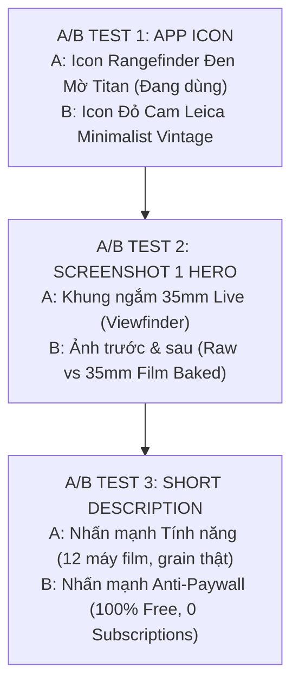

# RfCamera — ASO Master Matrix & Global Localization Blueprint

Tài liệu chiến lược và bộ tài sản tối ưu hóa App Store Optimization (ASO) toàn cầu cho **RfCamera** trên 5 thị trường trọng điểm: **English (US/Global)**, **Tiếng Việt (VN)**, **Japanese (JP)**, **Korean (KR)**, và **Spanish (ES/LATAM)**.

---

## 1. Bảng Ma Trận Từ Khóa & Định Vị ASO (ASO Keyword Matrix)

| Thị Trường | Từ Khóa Cốt Lõi (High Volume / Core) | Từ Khóa Đối Thủ & Thay Thế (Competitor / Intent) | Từ Khóa Đuôi Dài (Long-tail / Feature) |
| :--- | :--- | :--- | :--- |
| **English (Global)** | `film camera`, `35mm camera`, `vintage camera`, `retro photo`, `analog camera` | `dazz cam free`, `nomo cam alternative`, `dispo app`, `huji cam`, `vsco film` | `offline film camera`, `no subscription camera app`, `35mm grain shader`, `disposable camera light leak` |
| **Tiếng Việt (VN)** | `máy ảnh film`, `chụp ảnh film`, `app chỉnh màu film`, `chụp ảnh vintage` | `app giống dazz cam`, `dazz cam miễn phí`, `nomo miễn phí`, `app chụp màu film đẹp` | `app chụp film không quảng cáo`, `máy film dùng 1 lần`, `chụp ảnh tone hongkong`, `app chụp ảnh offline` |
| **Japanese (JP)** | `フィルムカメラ`, `レトロカメラ`, `35mmカメラ`, `エモい写真` | `Dazz風カメラ`, `トイカメラ無料`, `写ルンですアプリ`, `オールドデジカメ` | `完全オフラインカメラ`, `課金なしフィルムカメラ`, `フィルムカメラ無料`, `エモいフィルター` |
| **Korean (KR)** | `필름카메라`, `빈티지카메라`, `레트로카메라`, `35mm 필름` | `다즈캠 무료`, `필름필터 앱`, `구닥 대안`, `필름로그` | `무료 필름카메라 앱`, `오프라인 카메라`, `필름그레인`, `일회용카메라 앱` |
| **Spanish (ES)** | `cámara vintage`, `cámara analógica`, `fotos retro`, `cámara 35mm` | `alternativa dazz cam`, `cámara desechable app`, `filtros de película` | `cámara offline sin internet`, `cámara vintage gratis sin suscripción`, `efecto grano 35mm` |

---

## 2. Bộ Metadata Đa Ngôn Ngữ Chuẩn Hóa (Multilingual Store Metadata)

### A. English (US / Global)

* **App Title (26/30 chars)**: `RfCamera: 35mm Film Camera`
* **Subtitle / Short Description (76/80 chars)**: `12 vintage film cameras with real 35mm grain. 100% offline & fully unlocked.`
* **Keywords Field (iOS - 98/100 chars)**: `film,camera,35mm,vintage,retro,analog,dazz,grain,disposable,polaroid,lens,filter,offline,photo,leica`
* **Full Description (Play Store / App Store)**:
  ```markdown
  RfCamera brings 12 classic analog film cameras straight to your pocket. Not a simple color filter overlay — open RfCamera to look through an authentic 35mm rangefinder viewfinder with live 60fps grain, genuine light leaks, and optical shutter latency.

  100% FREE & FULLY OFFLINE
  • Zero sign-in, zero accounts, no tracking.
  • Completely offline: photos are baked directly on-device using GPU shaders and saved straight to your local gallery.
  • All 12 camera models, lenses (Fisheye, Prism, Star), and accessories are 100% unlocked forever.

  12 ICONIC FILM CAMERAS
  • FXN: Warm 35mm rangefinder tones with smooth skin reproduction.
  • CPM35: 1990s single-use disposable camera with punchy contrast and warm corner light leaks.
  • GR D: High-contrast street black & white with deep vignettes and micro grain.
  • CT2R: 1970s instant film with nostalgic cyan-green color cast.
  • S 67: 6x7 medium format with massive depth of field and silky color gradations.
  • D Half: 72-frame half-frame camera creating cinematic vertical diptychs.

  AUTHENTIC ANALOG CRAFT
  • Live Rangefinder Viewfinder: Optical frame lines, highlight shoulder compression, and vintage date stamps.
  • Color Profiles & Framing: Switch film variants and optical aspect ratios (4:3, 1:1, 16:9, 3:2).
  • Distinct Shutter Acoustics: Dedicated mechanical leaf shutter, ratchet gear, and motor sounds for every model.
  ```

---

### B. Tiếng Việt (Vietnamese)

* **Tên ứng dụng (26/30 ký tự)**: `RfCamera: Máy Ảnh Film 35mm`
* **Mô tả ngắn (78/80 ký tự)**: `12 máy film analog trong túi quần. Khung ngắm 35mm thật, 100% offline, miễn phí.`
* **Từ khóa iOS (96/100 ký tự)**: `máy ảnh film,chụp film,vintage,analog,35mm,dazz cam,cpm35,polaroid,chụp ảnh đẹp,offline,máy film`
* **Mô tả đầy đủ**:
  ```markdown
  RfCamera là bộ sưu tập 12 máy ảnh film analog kinh điển nằm gọn trong túi quần bạn. Không phải ứng dụng làm màu hay bộ lọc overlay thông thường — mở RfCamera là bạn bước thẳng vào khung ngắm 35mm thật với hạt grain chuyển động thời gian thực, lóa sáng quang học và tiếng màn trập cơ học độc bản.

  100% MIỄN PHÍ, HOÀN TOÀN OFFLINE & RIÊNG TƯ
  • 0 Đăng nhập, 0 đăng ký tài khoản, 0 theo dõi người dùng.
  • Hoạt động hoàn toàn Offline: ảnh được xử lý (bake) trực tiếp bằng GPU trên máy và lưu thẳng vào thư viện ảnh riêng của bạn, không tải lên bất kỳ đám mây nào.
  • Mở khóa toàn bộ: 12 thân máy, ống kính và mọi phụ kiện (Fisheye, Prism, Flash) đều sẵn sàng miễn phí trọn đời, không có gói nâng cấp hay paywall.

  12 THÂN MÁY FILM KINH ĐIỂN
  • FXN: Tông màu ấm 35mm kinh điển, mịn da, tương phản dịu.
  • CPM35: Máy film dùng một lần (disposable) rực rỡ, lóa sáng góc cam (light leak) và tương phản gắt.
  • GR D: Đen trắng đường phố sâu thẳm, viền tối sắc nét, hạt grain nghệ thuật.
  • CT2R: Chất màu film lấy liền Polaroid thập niên 70 với tông xanh ngọc hoài niệm.
  • S 67: Khổ trung 6x7 với độ sâu trường ảnh mê hồn và dải chuyển màu mượt mà.
  • D Half: Máy ảnh half-frame 72 kiểu, tự động ghép đôi 2 khung hình dọc cinematic.

  CẢM GIÁC CƠ HỌC CHÂN THỰC
  • Khung ngắm 35mm sống động: Tỷ lệ Rangefinder, vạch chia 3x3 và date stamp in ngày tháng cổ điển.
  • Cấu hình màu & Tỷ lệ: Chuyển đổi linh hoạt giữa các biến thể film gốc và tỷ lệ khung ngắm quang học (4:3, 1:1, 16:9, 3:2).
  • Chất âm màn trập độc bản: Mỗi dòng máy sở hữu một tiếng màn trập và âm thanh mô tơ cơ học riêng biệt.
  ```

---

### C. Japanese (日本語 - JP)

* **App Title (25/30 chars)**: `RfCamera: 35mmレトロフィルムカメラ`
* **Short Description (68/80 chars)**: `12種類の本格フィルムカメラ。完全オフライン、課金なし、本物の35mm粒子。`
* **Full Description**:
  ```markdown
  RfCameraは、ポケットに入る12種類の本格クラシック・フィルムカメラアプリです。単なるカラーフィルターではなく、リアルタイムのフィルムグレイン、光漏れ（ライトリーク）、光学的なシャッター遅延を備えた本物の35mmレンジファインダー体験を提供します。

  完全無料＆オフライン対応
  • アカウント登録不要、ログイン不要、追跡なし。
  • 100%オフライン処理：撮影した写真は端末内のGPUで直接現像され、外部サーバーにアップロードされることはありません。
  • すべてのカメラとレンズアクセサリーが最初から完全無料でアンロックされています。

  12種類の伝説的カメラモデル
  • FXN: 暖かみのある35mmトーン、滑らかなスキントーン。
  • CPM35: 90年代の使い捨てカメラ（写ルンです風）、鮮やかな光漏れ。
  • GR D: 深いシャドウと高コントラストのストリートモノクロ。
  • CT2R: 70年代風のポラロイド・インスタントフィルム。
  • S 67: 豊かな階調と深い被写界深度を持つ6x7中判カメラ。
  • D Half: 縦2コマを1枚に収める72枚撮りハーフフレームカメラ。
  ```

---

### D. Korean (한국어 - KR)

* **App Title (24/30 chars)**: `RfCamera: 35mm 빈티지 필름 카메라`
* **Short Description (62/80 chars)**: `12가지 클래식 필름 카메라. 100% 오프라인, 무료, 리얼 35mm 그레인.`
* **Full Description**:
  ```markdown
  RfCamera는 주머니 속에 12대의 클래식 아날로그 필름 카메라를 담아냅니다. 단순한 필터 앱이 아닌, 실시간 60fps 필름 그레인과 빛 번짐, 기계식 셔터 사운드가 담긴 진짜 35mm 레인지파인더 뷰파인더를 제공합니다.

  100% 무료 & 오프라인 지원
  • 가입 없음, 로그인 없음, 사용자 추적 없음.
  • 완전 오프라인: 사진은 기기 내부 GPU에서 직접 현상(Bake)되어 외부 클라우드에 업로드되지 않습니다.
  • 모든 12가지 카메라와 렌즈 액세서리가 평생 무료로 제공됩니다.

  12가지 시그니처 카메라
  • FXN: 따뜻한 35mm 색감과 부드러운 인물 톤.
  • CPM35: 90년대 감성의 일회용 카메라와 오렌지빛 빛 번짐.
  • GR D: 깊은 대비와 비네팅의 스트리트 흑백 카메라.
  • CT2R: 1970년대 빈티지 폴라로이드 즉석 필름.
  • S 67: 깊은 공간감과 뛰어난 해상력의 6x7 중형 카메라.
  • D Half: 세로 2장의 사진을 나란히 담아내는 72컷 하프프레임.
  ```

---

### E. Spanish (Español - ES / LATAM)

* **App Title (28/30 chars)**: `RfCamera: Cámara Film 35mm`
* **Short Description (78/80 chars)**: `12 cámaras de película vintage con grano 35mm real. 100% offline y gratuita.`
* **Full Description**:
  ```markdown
  RfCamera es una colección de 12 cámaras analógicas clásicas en tu bolsillo. No es una simple aplicación de filtros: abre RfCamera y dispara a través de un visor telemétrico real de 35mm con grano auténtico, fugas de luz ópticas y sonidos de obturador mecánico.

  100% GRATIS Y COMPLETAMENTE OFFLINE
  • Sin cuentas, sin registros, sin seguimiento de datos.
  • Totalmente offline: las fotos se procesan directamente en tu dispositivo con aceleración GPU y se guardan en tu almacenamiento local.
  • Todas las cámaras, lentes (Ojo de pez, Prisma, Filtro estrella) y accesorios están completamente desbloqueados para siempre.

  12 CÁMARAS CLÁSICAS
  • FXN: Tonos cálidos de 35mm con reproducción de piel suave.
  • CPM35: Cámara desechable de los 90 con fugas de luz cálidas y gran contraste.
  • GR D: Blanco y negro de calle de alto contraste con viñetas profundas.
  • CT2R: Película instantánea de los años 70 con tinte verde azulado nostálgico.
  • S 67: Formato medio 6x7 con impresionante profundidad de campo.
  • D Half: Cámara de medio cuadro de 72 disparos con dípticos verticales.
  ```

---

## 3. Khung Thử Nghiệm A/B Testing Hình Ảnh & Chuyển Đổi (Conversion Rate Optimization)


